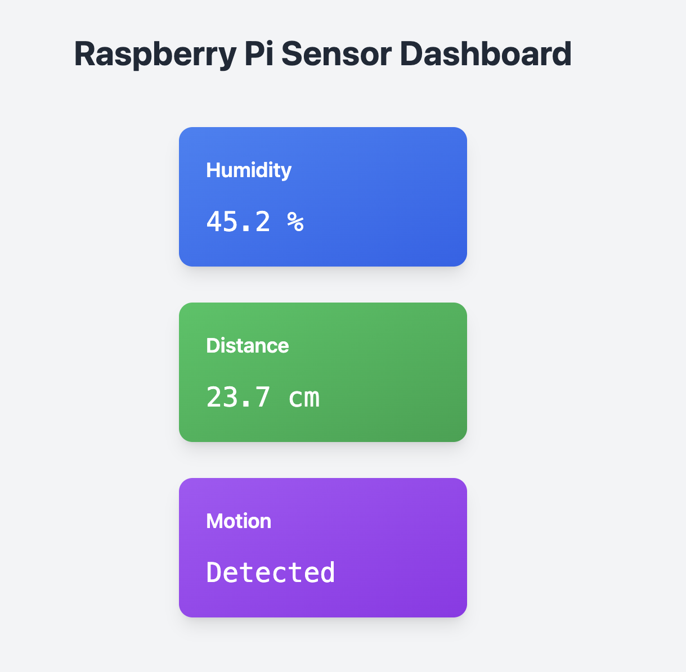

# RPi Sensor Activity

A Sugar activity for monitoring various sensors connected to a Raspberry Pi. This educational tool allows students to visualize and understand real-time sensor data.

## Overview

RPi Sensor Activity provides a modern, user-friendly dashboard that displays readings from multiple sensors:
* Temperature & Humidity (DHT11)
* Distance (HC-SR04 Ultrasonic)
* Motion (PIR Sensor)



## Features

* Real-time sensor data updates every 2 seconds
* Modern card-based UI with gradient backgrounds
* Interactive hover effects
* Error handling and status display
* Clean, readable sensor value presentation

## Hardware Requirements

* Raspberry Pi (any model)
* DHT11 Temperature & Humidity Sensor (connected to GPIO4)
* HC-SR04 Ultrasonic Distance Sensor
  * Trigger Pin: GPIO5
  * Echo Pin: GPIO6
* PIR Motion Sensor (connected to GPIO7)

## Software Requirements

* Sugar Desktop Environment
* Python 3.x
* Required Python packages:
  * adafruit-circuitpython-dht
  * adafruit-circuitpython-hcsr04
  * adafruit-blinka
  * PyGObject

## Wiring Guide

### DHT11 Sensor
* VCC → 3.3V
* Data → GPIO4
* GND → GND

### HC-SR04 Sensor
* VCC → 5V
* Trigger → GPIO5
* Echo → GPIO6
* GND → GND

### PIR Motion Sensor
* VCC → 5V
* Data → GPIO7
* GND → GND

## Usage

1. Launch the activity from Sugar's home view
2. The dashboard will automatically start displaying sensor readings
3. Readings update every 2 seconds
4. Error messages will be displayed if any sensor encounters issues

## Development

### File Structure
```
rpi-sensor-activity/
├── activity/
│   ├── activity.info
│   └── activity-icon.svg
├── activity.py
├── setup.py
└── README.md
```


## Troubleshooting

Common issues and solutions:

1. **"No module named 'adafruit_dht'"**
   * Ensure all required packages are installed
   * Check Python environment

2. **Sensor reading errors**
   * Check wiring connections
   * Verify power supply
   * Ensure correct GPIO pins are specified
